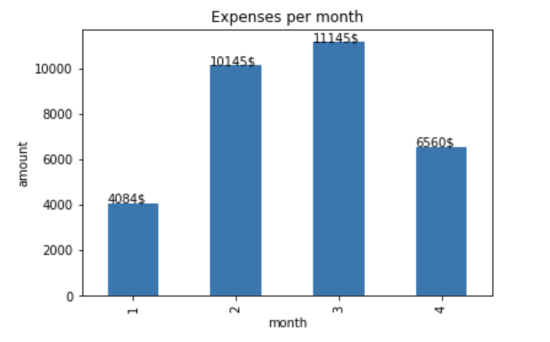
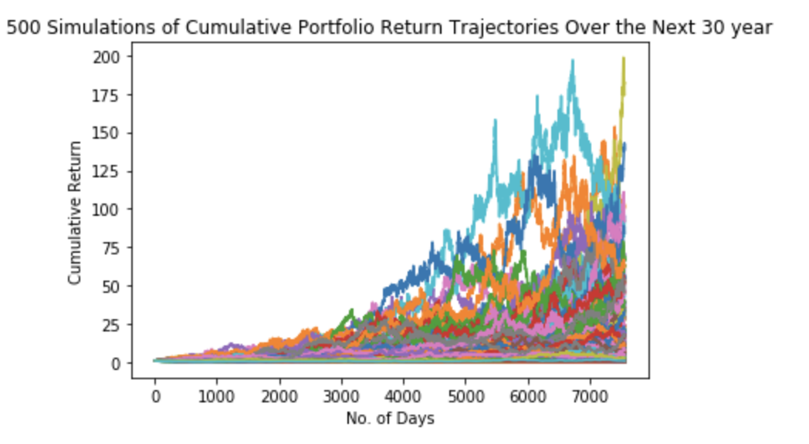
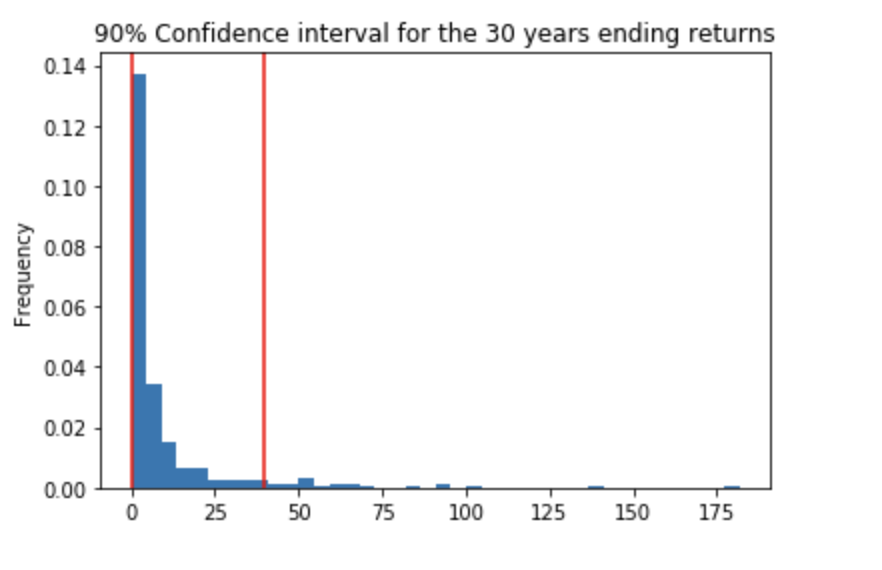
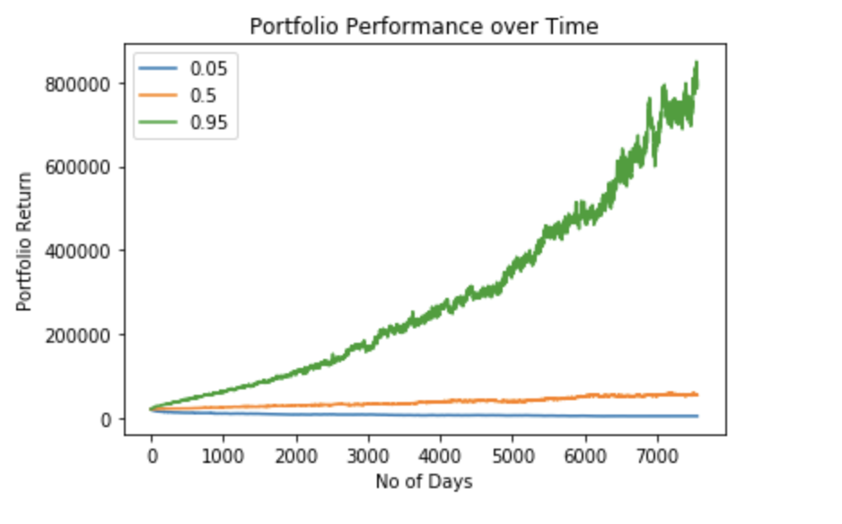

# Financial Planner

Implemented budgeting using Plaid API and the Monte Carlo Simulation for forcasting the Retirement Portfolio return using IEX Finance API


## Background

The consumer division of Harold's company has decided to offer budgeting and financial planning services to customers. They want to build a report for customers that links to their banking and investment accounts and automatically refreshes the data and charts on login. However, some of the calculations are tricky, and Harold could really use some help connecting the accounts and simulating the retirement investment projections. Luckily, there are APIs available to obtain account transactions and fetch retirement portfolio prices.

We will help Harold complete the following tasks:

1. [Budget Analysis with Plaid](#Budget-Analysis)
2. [Retirement Planner](#Retirement-Planner)
3. [Financial Report](#Financial-Report)

- - -

### Files

[Budget Starter Notebook](Starter_Code/account_summary.ipynb)

[Retirement Planner Starter Notebook](Starter_Code/portfolio_planner.ipynb)

- - -

### Budget Analysis

Below are the budget analysis report using the transaction details retrieved from the Plaid API.

1. Income Analysis Report using Plaid

    ```
    The Previous year gross income : 7285.0$
    The Current monthly income : 500.0$
    The Projected yearly income : 6085.0$
    ```

2. Visualization of basic Budget analysis on the sandbox transaction:

    * `Spending Categories Pie Chart`
        - Total expenses were $31,935.72 out of which 64.3% is for the Transfers and lowest expenses are for Travel 0.1%

      

    * `Transactions-per-categories`
        - Food & Drinks have the highest number of transactions - 15 while Recreations & Shops have the lowest number of transactions - 3 each
      
        
  
    * `Spending Per Month Bar Chart`
        - Highest expenses are accounted in the month of March, while the lowest expenses are for January

      


### Retirement Planner

Using the IEX API to fetch historical closing prices for a retirement portfolio using the `SPY` and `AGG` tickers to represent the 60% stocks (SPY) and 40% bonds (AGG) and then run Monte Carlo simulations to project the portfolio performance at 30 years. 


#### Monte Carlo Simulation


1. Visualization of `500` simulations of the potential trajectories of the portfolio based on next 30 years
    
    

2. Visualization of the `90% confidence interval` distribution of the ending cumulative returns from the Monte Carlo simulation
    
    
    

#### Retirement Analysis

Use the Monte Carlo simulation data to answer the following questions:

1. What are the expected cumulative returns at 30 years for the 10th, 50th, and 90th percentiles?

    ```
    Expected Cumulative Return at 30 year
    10th Percentile  : 0.31
    50th Percentile  : 2.71
    90th Percentile  : 20.88
    ```

2. Given an initial investment of $20,000, what is the expected return in dollars at the 10th, 50th, and 90th percentiles?

    ```
    Expected Portfolio Return at 30 year
    10th Percentile  : 6200.0$
    50th Percentile  : 54200.0$
    90th Percentile  : 417600.0$
    ```

3. Given the current projected annual income from the Plaid analysis, will a 4% withdrawal rate meet or exceed that value at the 10th percentile? Note: This is basically determining if retirement income is equivalent to current income.
    ```
    The current projected annual income is 6085$, 4% withdraw rate from the retirement portfolio is 248$ doesn't meet the value at the 10th percentile with the initial investment amount of 20000$
    ```
    
4. How would a 50% increase in the initial investment amount affect the 4% retirement withdrawal? In other words, what happens if the initial investment had been bigger?

    ```
    The 50% increase in the initial investment amount is 30000$, doesn't exceeds the value at the 10th percentile which is 372$ after 4% withdraw rate from the retirement portfolio
    ```

5. Use the Monte Carlo data and calculate the cumulative returns at the 5%, 50%, and 95% quartiles and plot this data as a line chart to see how the cumulative returns change over the life of the investment.
    
    

---

